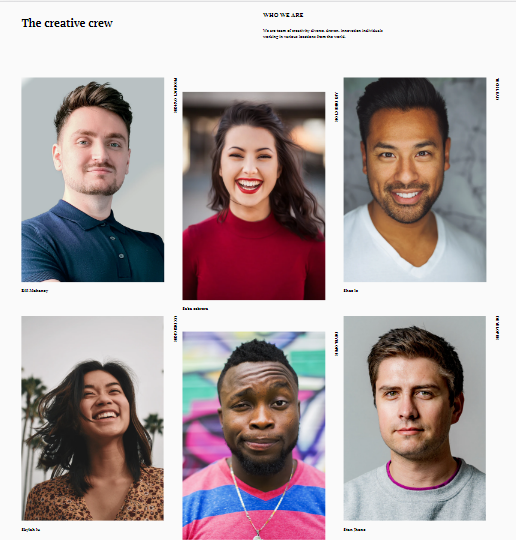

# Responsive Challenge 1

[Link of this project](https://affectionate-turing-f5c174.netlify.app/)

Challenge: Create my team page following the design. The page should be responsive. Don’t look at the existing solution. Fulfill user stories below

-   User story: I can see a page following the given design

As long as you fulfill all the user stories, you can give your personal touches by adding transition, using your own images, changing colors, or even creating your own layout,...

# My team Page

## Structure

In this website I am working on scss. To get start, I need follow these steps:

1- Create the package.json 

2- Install node modules by using npm i -D node-sass so that I get the dev independancy

3- Create gitignore file to ignore the node_modules

4- Once the package is created, edit the scripts code about css and css watch to run the code

## The design

I have a figma app and I work with that to help me.

Figma link : https://www.figma.com/file/F8d1qJsorEdY47N74HLxQ4/team-page-challenge

## Requirement

I have to indent my work and comment it to make it understandable. 
In addition, everytime I have changes I have to commit it and push if I want to.

**Message**

I hope I will have a lot of improvement by doing this website.

***I pray I am going to enjoy my work*** 